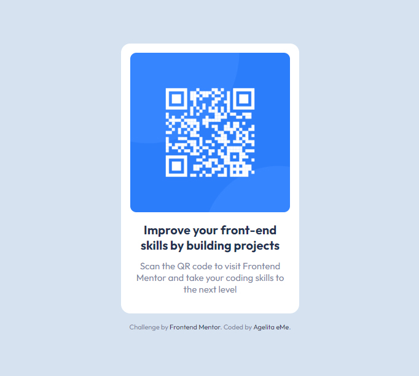

# Frontend Mentor - QR code component solution

This is a solution to the [QR code component challenge on Frontend Mentor](https://www.frontendmentor.io/challenges/qr-code-component-iux_sIO_H). Frontend Mentor challenges help you improve your coding skills by building realistic projects.

## Table of contents

- [Screenshot](#screenshot)
- [Links](#links)
- [Built with](#built-with)
- [What I learned](#what-i-learned)
- [Continued development](#continued-development)
- [Useful resources](#useful-resources)
- [Author](#author)

### Screenshot

### Links

- Solution URL: [Add solution URL here](https://your-solution-url.com)
- Live Site URL: [Add live site URL here](https://your-live-site-url.com)

### Built with

- Semantic HTML5 markup
- CSS custom properties
- Flexbox

### What I learned

Although is true that, it seems, I got to the end of the challenge, I don't feel my solution is 100% correct. I still have a lot to learn, like how to reduce the amount of code or making my projects more responsive.

### Continued development

I am just starting, so I think I should work on (almost everything):

- Reducing the amount of code
- Making my projects more responsive
- Using Media queries properly

### Useful resources

- [Free Code Camp](https://www.freecodecamp.org/)

## Author

- Frontend Mentor - [@agelitaeme](https://www.frontendmentor.io/profile/agelitaeme)
- Twitter - [@Agelita_eMe](https://twitter.com/Agelita_eMe)
